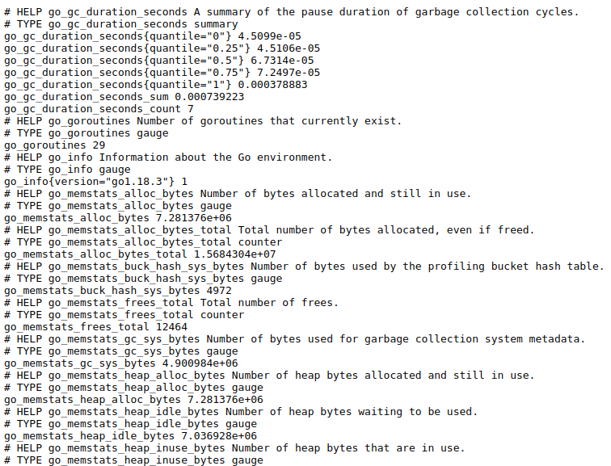

# Easy coding | [中文](docs/README_CN.md)

This repo contains an example structure for a monolithic Go Web Application.

## Project Architecture

This project loosely follows [Uncle Bob's Clean Architecture](https://blog.cleancoder.com/uncle-bob/2012/08/13/the-clean-architecture.html).


## Project principle

[Single source of truth (SSOT)](https://en.wikipedia.org/wiki/Single_source_of_truth)

## Features

- 100% API defined by protobuf
- Auto generate grpc, grpc gateway, validate go files
- Provide both rest api and grpc api
- Auto generate swagger api document
- Builtin prometheus metrics
- Support import api definition by postman
- Run in docker
- Auto configuration generate
- Database migrate up and down
- Database mock testing
- Golang, Protobuf and basic text file linting
- Error definition and classification
- Auto logging and pretty format
- Unit test and test coverage
- Graceful stop
- Backend processes
- Health check

## Prerequest

- [protoc](https://github.com/protocolbuffers/protobuf#protocol-compiler-installation)

- protoc plugins, go, grpc, grpc-gateway, openapi, validate

``` bash
go install \
    github.com/grpc-ecosystem/grpc-gateway/v2/protoc-gen-grpc-gateway@latest \
    github.com/grpc-ecosystem/grpc-gateway/v2/protoc-gen-openapiv2@latest \
    google.golang.org/protobuf/cmd/protoc-gen-go@latest \
    google.golang.org/grpc/cmd/protoc-gen-go-grpc@latest \
    github.com/envoyproxy/protoc-gen-validate@latest
```

- golang 1.18+

- [protobuf management](https://docs.buf.build/installation)

- [go swagger cli](https://github.com/go-swagger/go-swagger/releases)

- docker and docker compose

- (optional) pre-commit

``` bash
pip3 install pre-commit
pre-commit install
```

- (optional) golang lint

``` bash
go install github.com/golangci/golangci-lint/cmd/golangci-lint@latest
```

## Getup and running

**Modify the `GOPROXY` env in the dockerfile, when the download speed is slow**

``` bash
make deps
make run
```

**NOTE: The first time you MUST create database `test` manully or you will recevice following error**

``` text
failed to initialize database, got error [driver: bad connection]
```

``` bash
docker exec -it easycoding-mysql-1 bash
mysql -u root -p123456
create database test;
```

The following files will be generated

- api/{module_name}/{module_name}.pb.go
- api/{module_name}/{module_name}.pb.validate.go
- api/{module_name}/{module_name}.pb.swagger.json
- api/{module_name}/rpc_grpc.pb.go
- api/{module_name}/rpc.pb.go
- api/{module_name}/rpc.pb.gw.go
- api/{module_name}/rpc.pb.validate.go
- api/{module_name}/rpc.swagger.json

There are three exported ports

- 10000: rest api server
- 10001: grpc api server
- 10002: swagger api and prometheus server

Check rest api server

``` bash
curl http://localhost:10000/ping
```

Check grpc api server

``` bash
go run cmd/client/main.go
```

Open the following url in the browser

- http://localhost:10002/swagger/
- http://localhost:10002/metrics




### Topic1 API management

#### Motivation

In many cases, there are many files to describe one api

- Some struct/class in golang/java files
- Some class in typescript/javascript files
- Swagger/Openapi
- Readable document

That violate the [`Single source of truth`](https://en.wikipedia.org/wiki/Single_source_of_truth) principle, it is necessary to define
the api in one place, and generate other files.

#### Get started

In this topic, we will add a new greet service

api/greet_apis/greet/greet.proto

``` protobuf
syntax = "proto3";

package greet;

option go_package = 'easycoding/api/greet';

message HelloRequest {
    string req = 1;
}

message HelloResponse {
    string res = 1;
}
```

api/greet_apis/greet/greet.proto

``` protobuf
syntax = "proto3";

package greet;

option go_package = 'easycoding/api/greet';

import "google/api/annotations.proto";
import "greet/greet.proto";

// The greet service definition.
service GreetSvc {
    rpc Hello(HelloRequest) returns (HelloResponse) {
        option (google.api.http) = {
            get: "/hello",
        };
    }
}
```

api/greet_apis/buf.yaml

``` yaml
version: v1
breaking:
  use:
    - FILE
lint:
  use:
    - DEFAULT
```

api/buf.work.yaml

``` yaml
   - payment_apis
   - pet_apis
   - ping_apis
   # add new line
   - greet_apis
```

Run `make gen-api` in the workspace, the following files will be generated

``` text
api/greet/greet.pb.go
api/greet/greet.pb.validate.go
api/greet/greet.swagger.json
api/greet/rpc_grpc.pb.go
api/greet/rpc.pb.go
api/greet/rpc.pb.gw.go
api/greet/rpc.pb.validate.go
api/greet/rpc.swagger.json
api/api.swagger.json
```

Implement the greet service

internal/service/greet/service.go

``` golang
package greet

import (
	"context"
	greet_pb "easycoding/api/greet"

	"github.com/sirupsen/logrus"
)

type service struct{}

var _ greet_pb.GreetSvcServer = (*service)(nil)

func New(logger *logrus.Logger) *service {
	return &service{}
}

func (s *service) Hello(
	ctx context.Context,
	req *greet_pb.HelloRequest,
) (*greet_pb.HelloResponse, error) {
	return &greet_pb.HelloResponse{Res: req.Req}, nil
}
```

Update internal/service/register.go

``` golang
var endpointFuns = []RegisterHandlerFromEndpoint{
	ping_pb.RegisterPingSvcHandlerFromEndpoint,
	pet_pb.RegisterPetStoreSvcHandlerFromEndpoint,
    // add new line
	greet_pb.RegisterGreetSvcHandlerFromEndpoint,
}

func RegisterServers(grpcServer *grpc.Server, logger *logrus.Logger, db *gorm.DB) {
	ping_pb.RegisterPingSvcServer(grpcServer, ping_svc.New(logger))
	pet_pb.RegisterPetStoreSvcServer(grpcServer, pet_svc.New(logger, db))
    // add new line
	greet_pb.RegisterGreetSvcServer(grpcServer, greet_svc.New())
}

```

Run the server

``` bash
make run
```

Check the rest http server

``` bash
curl localhost:10000/hello?req=hi
```

The new api document is in `http://localhost:10002/swagger/`, if you want to
custom the output of openapi see
[protoc-gen-openapi](https://grpc-ecosystem.github.io/grpc-gateway/docs/mapping/customizing_openapi_output/)
for more information.

``` proto
message MyMessage {
  // This comment will end up direcly in your Open API definition
  string uuid = 1 [(grpc.gateway.protoc_gen_openapiv2.options.openapiv2_field) = {description: "The UUID field."}];
}
```

The new metrics is in `http://localhost:10002/metrics`, you can use
prometheus-client to custom metrics, see
[go-grpc-prometheus](https://github.com/grpc-ecosystem/go-grpc-prometheus/blob/master/examples/grpc-server-with-prometheus/server/server.go#L39)
for example.

``` golang
customizedCounterMetric = prometheus.NewCounterVec(prometheus.CounterOpts{
    Name: "demo_server_say_hello_method_handle_count",
    Help: "Total number of RPCs handled on the server.",
}, []string{"name"})
```

You can add some validate to your api like following

``` protobuf
syntax = "proto3";

package greet;

option go_package = 'easycoding/api/greet';

// add new line
import "validate/validate.proto";

message HelloRequest {
    // add validate
    string req = 1[(validate.rules).string = {min_len: 0, max_len: 10}];
}

message HelloResponse {
    string res = 1;
}
```

Stop the server and run `make gen-api` and `make run` again.

Send the following request and will return error, see
[protoc-gen-validate](https://github.com/envoyproxy/protoc-gen-validate) for
more validate rule.

``` bash
curl localhost:10000/hello?req=hiiiiiiiiii
```

Validator is checked request in the grpc middleware, you can find some common
middlewares in
[grpc-middleware](https://github.com/grpc-ecosystem/go-grpc-middleware), or you
can custom your own middleware.

### Topic2 Database migrate

#### Motivation

Write raw sql to operate database is not easy to maintain, we use ORM to
interact with database, [Gorm](https://github.com/go-gorm/gorm) for this
project. Another situation we encounter is that we often upgrade the structure
of the database, firstly, in many compaines, people who write the code and
deploy applications are different, so it is necessary to manage upgrade and
downgrade properly, secondly we can intergrate sql files into intergration test
to ensure the correctness of database structure, thirdly, it is hard to write
up and down sql file manully.

#### Get started

For the current time, the database `test` is totally empty, use the following command to create auto migration sql files

``` bash
make migrate-create
```

The following files will be generated, see [migrate](https://github.com/golang-migrate/migrate) for more information

``` text
migrations/pet/{timestamp}_pet.up.sql
migrations/pet/{timestamp}_pet.down.sql
```

Migrate sql to database, in the cloud native scenario, you usually need to start
a [kubernetes job](https://kubernetes.io/docs/concepts/workloads/controllers/job/) to migrate the database, so the command is not intergrate with Makefile.

``` bash
go run cmd/migrate/main.go step --latest
```

``` text
INFO[0000] Start buffering 20220723144816/u pet
INFO[0000] Read and execute 20220723144816/u pet
INFO[0000] Finished 20220723144816/u pet (read 5.465976ms, ran 57.983119ms)
```

Migrate successful, use `describe pet` to check the schema of table pet

``` text
+------------+----------+------+-----+-------------------+-------------------+
| Field      | Type     | Null | Key | Default           | Extra             |
+------------+----------+------+-----+-------------------+-------------------+
| id         | int      | YES  |     | NULL              |                   |
| name       | text     | YES  |     | NULL              |                   |
| type       | int      | YES  |     | NULL              |                   |
| created_at | datetime | YES  |     | CURRENT_TIMESTAMP | DEFAULT_GENERATED |
+------------+----------+------+-----+-------------------+-------------------+
4 rows in set (0.01 sec)
```

Update pkg/orm/pet.go

``` text
--- a/pkg/orm/pet.go
+++ b/pkg/orm/pet.go
@@ -12,6 +12,7 @@ type Pet struct {
        Name string
        // TODO(qujiabao): replace int32 to pet_pb.PetType, because of `sqlize`
        Type      int32
+       Age       int32
        CreatedAt time.Time `gorm:"default:now()"`
 }
```

Create migration files and two files will be generated, and there are four files
in migrations/pet

``` bash
make migrate-create
```

Step up

``` bash
go run cmd/migrate/main.go step --latest
```

Check the current version of database

``` bash
go run cmd/migrate/main.go version
```

``` text
Version: 20220723150428, Dirty: false
```

``` text
+------------+----------+------+-----+-------------------+-------------------+
| Field      | Type     | Null | Key | Default           | Extra             |
+------------+----------+------+-----+-------------------+-------------------+
| id         | int      | YES  |     | NULL              |                   |
| name       | text     | YES  |     | NULL              |                   |
| type       | int      | YES  |     | NULL              |                   |
| age        | int      | YES  |     | NULL              |                   |
| created_at | datetime | YES  |     | CURRENT_TIMESTAMP | DEFAULT_GENERATED |
+------------+----------+------+-----+-------------------+-------------------+
5 rows in set (0.00 sec)
```

Downgrade the database version

``` bash
go run cmd/migrate/main.go step 1 --reverse
```

``` text
Version: 20220723144816, Dirty: false

+------------+----------+------+-----+-------------------+-------------------+
| Field      | Type     | Null | Key | Default           | Extra             |
+------------+----------+------+-----+-------------------+-------------------+
| id         | int      | YES  |     | NULL              |                   |
| name       | text     | YES  |     | NULL              |                   |
| type       | int      | YES  |     | NULL              |                   |
| created_at | datetime | YES  |     | CURRENT_TIMESTAMP | DEFAULT_GENERATED |
+------------+----------+------+-----+-------------------+-------------------+
4 rows in set (0.00 sec)
```

### Topic3 Linter

### Topic4 Error handling

### Topic5 Configuration

### Topic6 Unit test and coverage

### Topic7 Release and deploy

### Topic8 Monitor, logging and trace

## TODO

- Use reflect in configration
- Benchmark
- Fix linting
- Intergration test
- Auth
- More options in configuration
- Property based test
- GraphQL server

## Inspirations

- https://github.com/OFFLINE-GmbH/go-webapp-example
- https://github.com/golang-standards/project-layout
