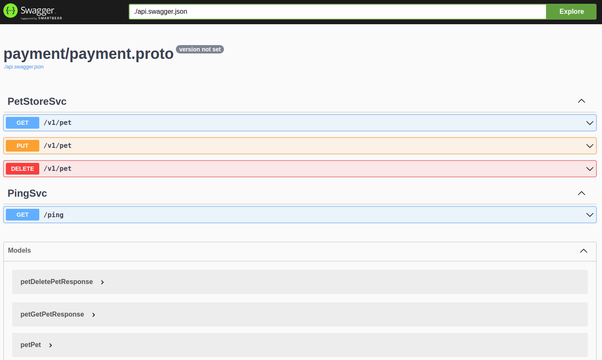
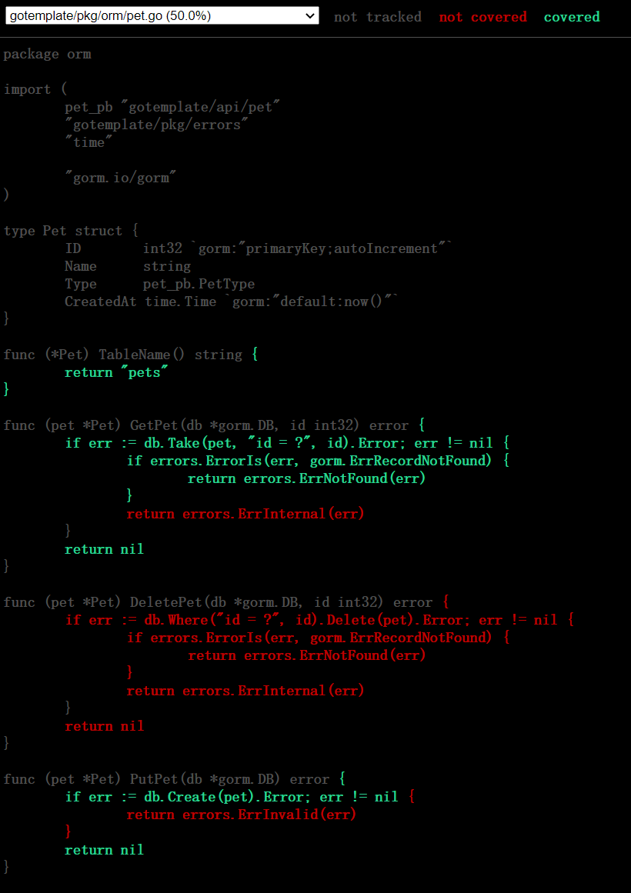

# Easy coding | [中文](docs/README_CN.md)

This repo contains an example structure for a monolithic Go Web Application.

## Project Architecture

This project loosely follows [Uncle Bob's Clean Architecture](https://blog.cleancoder.com/uncle-bob/2012/08/13/the-clean-architecture.html).


## Project principle

[Single source of truth (SSOT)](https://en.wikipedia.org/wiki/Single_source_of_truth)

## Features

- 100% API defined by protobuf
- Auto generate grpc, grpc gateway, validate go files
- Provide both rest api and grpc api
- Auto generate swagger api document
- Breaking change detection
- Builtin prometheus metrics
- Support import api definition by postman
- Run in docker
- Auto configuration generate
- Database migrate up and down
- Database mock testing
- Golang, Protobuf and basic text file linting
- Error definition and classification
- Auto logging and pretty format
- Unit test and test coverage
- Graceful stop
- Backend processes
- Health check

## Prerequest

- [protoc](https://github.com/protocolbuffers/protobuf#protocol-compiler-installation)

- protoc plugins, go, grpc, grpc-gateway, openapi, validate

``` bash
go install \
    github.com/grpc-ecosystem/grpc-gateway/v2/protoc-gen-grpc-gateway@latest \
    github.com/grpc-ecosystem/grpc-gateway/v2/protoc-gen-openapiv2@latest \
    google.golang.org/protobuf/cmd/protoc-gen-go@latest \
    google.golang.org/grpc/cmd/protoc-gen-go-grpc@latest \
    github.com/envoyproxy/protoc-gen-validate@latest
```

- golang 1.18+

- [protobuf management](https://docs.buf.build/installation)

- [go swagger cli](https://github.com/go-swagger/go-swagger/releases)

- docker and docker compose

- (optional) pre-commit

``` bash
pip3 install pre-commit
pre-commit install
```

- (optional) golang lint

``` bash
go install github.com/golangci/golangci-lint/cmd/golangci-lint@latest
```

## Getup and running

**Modify the `GOPROXY` env in the dockerfile, when the download speed is slow**

``` bash
make deps
make run
```

The following files will be generated

- api/{module_name}/{module_name}.pb.go
- api/{module_name}/{module_name}.pb.validate.go
- api/{module_name}/{module_name}.pb.swagger.json
- api/{module_name}/rpc_grpc.pb.go
- api/{module_name}/rpc.pb.go
- api/{module_name}/rpc.pb.gw.go
- api/{module_name}/rpc.pb.validate.go
- api/{module_name}/rpc.swagger.json

There are three exported ports

- 10000: rest api server
- 10001: grpc api server
- 10002: swagger api and prometheus server

Check rest api server

``` bash
curl http://localhost:10000/ping
```

Check grpc api server

``` bash
go run cmd/client/main.go
```

Open the following url in the browser

- http://localhost:10002/swagger/
- http://localhost:10002/metrics




### Topic1 API management

#### Motivation

Api is an abstract concept, is language independent, in many cases, there are
many files to describe an api

- Some struct/class in golang/java files
- Some class in typescript/javascript files
- Swagger/Openapi
- Readable document

That violate the [`Single source of truth`](https://en.wikipedia.org/wiki/Single_source_of_truth)
principle, it should define the api in one place, and generate other files.

#### Get started

In this topic, we will add a new greet service

api/greet_apis/greet/greet.proto

``` protobuf
syntax = "proto3";

package greet;

option go_package = 'easycoding/api/greet';

message HelloRequest {
    string req = 1;
}

message HelloResponse {
    string res = 1;
}
```

api/greet_apis/greet/rpc.proto

``` protobuf
syntax = "proto3";

package greet;

option go_package = 'easycoding/api/greet';

import "google/api/annotations.proto";
import "greet/greet.proto";

// The greet service definition.
service GreetSvc {
    rpc Hello(HelloRequest) returns (HelloResponse) {
        option (google.api.http) = {
            get: "/hello",
        };
    }
}
```

api/greet_apis/buf.yaml

``` yaml
version: v1
breaking:
  use:
    - FILE
lint:
  use:
    - DEFAULT
```

api/buf.work.yaml

``` yaml
   - payment_apis
   - pet_apis
   - ping_apis
   # add new line
   - greet_apis
```

Run `make gen-api` in the workspace, the following files will be generated

``` text
api/greet/greet.pb.go
api/greet/greet.pb.validate.go
api/greet/greet.swagger.json
api/greet/rpc_grpc.pb.go
api/greet/rpc.pb.go
api/greet/rpc.pb.gw.go
api/greet/rpc.pb.validate.go
api/greet/rpc.swagger.json
api/api.swagger.json
```

Implement the greet service

internal/service/greet/service.go

``` golang
package greet

import (
	"context"
	greet_pb "easycoding/api/greet"

	"github.com/sirupsen/logrus"
)

type service struct{}

var _ greet_pb.GreetSvcServer = (*service)(nil)

func New(logger *logrus.Logger) *service {
	return &service{}
}

func (s *service) Hello(
	ctx context.Context,
	req *greet_pb.HelloRequest,
) (*greet_pb.HelloResponse, error) {
	return &greet_pb.HelloResponse{Res: req.Req}, nil
}
```

Update internal/service/register.go

``` golang
var endpointFuns = []RegisterHandlerFromEndpoint{
	ping_pb.RegisterPingSvcHandlerFromEndpoint,
	pet_pb.RegisterPetStoreSvcHandlerFromEndpoint,
    // add new line
	greet_pb.RegisterGreetSvcHandlerFromEndpoint,
}

func RegisterServers(grpcServer *grpc.Server, logger *logrus.Logger, db *gorm.DB) {
	ping_pb.RegisterPingSvcServer(grpcServer, ping_svc.New(logger))
	pet_pb.RegisterPetStoreSvcServer(grpcServer, pet_svc.New(logger, db))
    // add new line
	greet_pb.RegisterGreetSvcServer(grpcServer, greet_svc.New())
}

```

Run the server

``` bash
make run
```

Check the rest http server

``` bash
curl localhost:10000/hello?req=hi
```

The new api document is in `http://localhost:10002/swagger/`, if you want to
custom the output of openapi see
[protoc-gen-openapi](https://grpc-ecosystem.github.io/grpc-gateway/docs/mapping/customizing_openapi_output/)
for more information.

``` proto
message MyMessage {
  // This comment will end up direcly in your Open API definition
  string uuid = 1 [(grpc.gateway.protoc_gen_openapiv2.options.openapiv2_field) = {description: "The UUID field."}];
}
```

The new metrics is in `http://localhost:10002/metrics`, you can use
prometheus-client to custom metrics, see
[go-grpc-prometheus](https://github.com/grpc-ecosystem/go-grpc-prometheus/blob/master/examples/grpc-server-with-prometheus/server/server.go#L39)
for example.

``` golang
customizedCounterMetric = prometheus.NewCounterVec(prometheus.CounterOpts{
    Name: "demo_server_say_hello_method_handle_count",
    Help: "Total number of RPCs handled on the server.",
}, []string{"name"})
```

You can add some validate to your api like following

``` protobuf
syntax = "proto3";

package greet;

option go_package = 'easycoding/api/greet';

// add new line
import "validate/validate.proto";

message HelloRequest {
    // add validate
    string req = 1[(validate.rules).string = {min_len: 0, max_len: 10}];
}

message HelloResponse {
    string res = 1;
}
```

Stop the server and run `make gen-api` and `make run` again.

Send the following request and will return error, see
[protoc-gen-validate](https://github.com/envoyproxy/protoc-gen-validate) for
more validate rule.

``` bash
curl localhost:10000/hello?req=hiiiiiiiiii
```

Validator is checked request in the grpc middleware, you can find some common
middlewares in
[grpc-middleware](https://github.com/grpc-ecosystem/go-grpc-middleware), or you
can custom your own middleware.

#### Breaking change detection

``` bash
cd api/pet_apis
buf breaking   --against "../../.git#branch=master,subdir=api/pet_apis"
```

Incompatible changes

``` proto
// api/pet_apis/pet/pet.proto
message Pet {
    int32 pet_id = 1;
    string name = 2;
    // change the following type
    // PetType pet_type = 3;
    string pet_type = 3;
}
```

Check the compatibility

``` bash
cd api/pet_apis
buf breaking   --against "../../.git#branch=master,subdir=api/pet_apis"
```

``` text
pet/pet.proto:22:5:Field "3" on message "Pet" changed type from "enum" to "string".
```

Compatible changes

``` proto
// api/pet_apis/pet/pet.proto
message Pet {
    int32 pet_id = 1;
    string name = 2;
    PetType pet_type = 3;
    // add the following field
    string address = 4;
}
```

``` bash
cd api/pet_apis
buf breaking   --against "../../.git#branch=master,subdir=api/pet_apis"
```

### Topic2 Database migrate

#### Motivation

Write raw sql to operate database is not easy to maintain, we use ORM to
interact with database, [ent](https://github.com/ent/ent) for this
project. Another situation we encounter is that we often upgrade the structure
of the database, firstly, in many compaines, people who write the code and
deploy applications are different, so it is necessary to manage upgrade and
downgrade properly, secondly we can intergrate sql files into intergration test
to ensure the correctness of database structure, thirdly, it is hard to write
up and down sql file manully.

#### Get started

For the current time, the database `test` is totally empty, use the following
command to create auto migration sql files

``` bash
make migrate-generate
```

The following files will be generated, see
[migrate](https://github.com/golang-migrate/migrate) for more information

``` text
migrations/{timestamp}_changes.up.sql
migrations/{timestamp}_changes.down.sql
atlas.sum
```

Migrate sql to database, in the cloud native scenario, you usually need to start
a [kubernetes job](https://kubernetes.io/docs/concepts/workloads/controllers/job/)
to migrate the database, so the command is not intergrate with Makefile.

``` bash
go run cmd/migrate/main.go step --latest
```

``` text
INFO[0000] Start buffering 20220902103358/u changes
INFO[0000] Read and execute 20220902103358/u changes
INFO[0000] Finished 20220902103358/u changes (read 2.679112ms, ran 10.382479ms)
```

Migrate successful, use `describe pets` to check the schema of table pets

``` text
+-----------+--------------+------+-----+---------+----------------+
| Field     | Type         | Null | Key | Default | Extra          |
+-----------+--------------+------+-----+---------+----------------+
| id        | bigint       | NO   | PRI | NULL    | auto_increment |
| name      | varchar(255) | NO   |     | NULL    |                |
| type      | tinyint      | NO   |     | NULL    |                |
| create_at | timestamp    | NO   |     | NULL    |                |
+-----------+--------------+------+-----+---------+----------------+
4 rows in set (0.00 sec)
```

Update pkg/ent/schema/pet.go

``` text
--- a/pkg/ent/schema/pet.go
+++ b/pkg/ent/schema/pet.go
@@ -15,8 +15,8 @@ type Pet struct {
 // Fields of the Pet.
 func (Pet) Fields() []ent.Field {
        return []ent.Field{
                field.String("name").NotEmpty(),
+               field.Int32("age").NonNegative(),
                field.Int8("type").NonNegative(),
                field.Time("create_at").Default(time.Now()),
        }
```

Generate orm files

``` bash
go generate ./pkg/ent
```

Create migration files and two more files will be generated, and there are five
files in migrations/pet

``` bash
make migrate-generate
```

Step up

``` bash
go run cmd/migrate/main.go step --latest
```

Check the current version of database

``` bash
go run cmd/migrate/main.go version
```

``` text
Version: 20220723150428, Dirty: false
```

``` text
+-----------+--------------+------+-----+---------+----------------+
| Field     | Type         | Null | Key | Default | Extra          |
+-----------+--------------+------+-----+---------+----------------+
| id        | bigint       | NO   | PRI | NULL    | auto_increment |
| name      | varchar(255) | NO   |     | NULL    |                |
| type      | tinyint      | NO   |     | NULL    |                |
| create_at | timestamp    | NO   |     | NULL    |                |
| age       | int          | NO   |     | NULL    |                |
+-----------+--------------+------+-----+---------+----------------+
5 rows in set (0.00 sec)
```

Downgrade the database version

``` bash
go run cmd/migrate/main.go step 1 --reverse
```

``` text
Version: 20220723144816, Dirty: false

+-----------+--------------+------+-----+---------+----------------+
| Field     | Type         | Null | Key | Default | Extra          |
+-----------+--------------+------+-----+---------+----------------+
| id        | bigint       | NO   | PRI | NULL    | auto_increment |
| name      | varchar(255) | NO   |     | NULL    |                |
| type      | tinyint      | NO   |     | NULL    |                |
| create_at | timestamp    | NO   |     | NULL    |                |
+-----------+--------------+------+-----+---------+----------------+
4 rows in set (0.00 sec)
```

### Topic3 Linter

#### Motivation

- Cooperate in a same pattern
- Finds bugs during early stages of development
- Coding style as code
- Define rules to assist developers

<table>
<thead><tr><th>Bad</th> <th>Good</th></tr></thead>
<tbody>
<tr>
<td>

```go
func (d *Driver) SetTrips(trips []Trip) {
  d.trips = trips
}

trips := ...
d1.SetTrips(trips)

// Did you mean to modify d1.trips?
trips[0] = ...
```

</td>
<td>

```go
func (d *Driver) SetTrips(trips []Trip) {
  d.trips = make([]Trip, len(trips))
  copy(d.trips, trips)
}

trips := ...
d1.SetTrips(trips)

// We can now modify trips[0] without affecting d1.trips.
trips[0] = ...
```

</td>
</tr>

</tbody>
</table>

Alignment

<table>
<thead><tr><th>Bad</th> <th>Good</th></tr></thead>
<tbody>
<tr>
<td>

```go
// 12 bytes
type Foo struct {
	aaa bool
	bbb int32
	ссс bool
}
```

</td>
<td>

```go
// 8 bytes
type Foo struct {
	aaa bool
	ссс bool
	bbb int32
}
```

</td>
</tr>

</tbody>
</table>


For more information see [Uber golang style guide](https://github.com/uber-go/guide/blob/master/style.md)

#### Get started

``` bash
make lint
```

### Topic4 Error handling

#### Concept

Error vs Exception

Errors are the possible problems in program, is part of bussiness, like database
connection failed.

Exception is unexpectable problems in program, is not part of bussiness, like
nil pointer exception, array outof range.

#### Guideline

``` text
            ┌───────────────┐
            │               │
            │  handle error │
            │               │
            └───────────────┘
                    ▲
                    │
            ┌───────┴───────┐
            │               │
            │  with message │
            │               │
            └───────────────┘
                    ▲
                    │
            ┌───────┴───────┐
            │               │
            │   wrap error  │
            │               │
            └───────────────┘
                    ▲
                    │
            ┌───────┴───────┐
            │               │
            │   raw  error  │
            │               │
            └───────────────┘
```

#### Example

``` golang
// pkg/orm/pet.go
func (pet *Pet) GetPet(db *gorm.DB, id int32) error {
    // err is a raw err from gorm
	if err := db.Take(pet, "id = ?", id).Error; err != nil {
        // check the type of raw error
		if errors.ErrorIs(err, gorm.ErrRecordNotFound) {
            // wrap error
			return errors.ErrNotFound(err)
		}
        // wrap error
		return errors.ErrInternal(err)
	}
	return nil
}
```

``` golang
// internal/service/pet/get_pet.go
func (s *service) getPet(
	ctx context.Context,
	req *pet_pb.GetPetRequest,
) (*pet_pb.GetPetResponse, error) {
	pet := &orm.Pet{}
	if err := pet.GetPet(s.DB, req.PetId); err != nil {
        // with message in service
		return nil, errors.WithMessage(err, "get pet failed")
	}
}
```

``` golang
// internal/middleware/log/interceptor.go

// Describe how to log error
func Interceptor(logger *logrus.Logger) func(
	ctx context.Context,
	req interface{},
	_ *grpc.UnaryServerInfo,
	handler grpc.UnaryHandler) (interface{}, error) {
	ops := []grpc_logrus.Option{
        // map to log level
		grpc_logrus.WithLevels(levelFunc),
        // add decider
		grpc_logrus.WithDecider(decider),
	}
	entry := logrus.NewEntry(logger)

	logInterceptorBefore := createBeforeInterceptor(entry)
	logInterceptorAfter := createAfterInterceptor(entry)

	return grpc_middleware.ChainUnaryServer(
		logInterceptorBefore,
		grpc_logrus.UnaryServerInterceptor(entry, ops...),
		logInterceptorAfter,
	)
}
```

``` golang
// internal/middleware/error/interceptor.go

// error classification
func Interceptor(logger *logrus.Logger) grpc.UnaryServerInterceptor {
	return func(
		ctx context.Context,
		req interface{},
		reqinfo *grpc.UnaryServerInfo,
		handler grpc.UnaryHandler,
	) (interface{}, error) {
		res, err := handler(ctx, req)
		if err == nil {
			return res, err
		}
		var code codes.Code

		switch {
		case errors.ErrorIs(err, errors.InternalError):
			code = codes.Internal
		case errors.ErrorIs(err, errors.InvalidError):
			code = codes.InvalidArgument
		case errors.ErrorIs(err, errors.NotFoundError):
			code = codes.NotFound
		case errors.ErrorIs(err, errors.PermissionError):
			code = codes.PermissionDenied
		case errors.ErrorIs(err, errors.UnauthorizedError):
			code = codes.Unauthenticated
		default:
			logger.WithError(err).WithField("method", reqinfo.FullMethod).
				Warn("invalid err, without using easycoding/pkg/errors")
			return res, err
		}
		s := status.New(code, err.Error())
		return res, s.Err()
	}
}
```

### Topic5 Configuration

#### Motivation

Configuration is an abstract concept, language independent, in many cases, we
describe configuration is many files

- yaml file
- json
- golang struct

That violate the [`Single source of truth`](https://en.wikipedia.org/wiki/Single_source_of_truth)
principle, it should define the api in one place, and generate other files.

Configuration should combine the following sources and bind to struct

- explicit call `Set`
- command line flag
- env
- file
- default

### Topic6 Unit test and coverage

#### Get started

Run all tests

``` bash
make test
```

Run all tests with coverage

``` bash
make coverage
```

Run all tests with coverage and open the report in browser

``` bash
make coverage-html
```



### Topic7 Release and deploy

### Topic8 Monitor, logging and trace

## TODO

- Use reflect in configration
- Benchmark
- Fix linting
- Intergration test
- Auth
- More options in configuration
- Property based test
- GraphQL server
- Use go generate to refactor proto and bindata generation

## Inspirations

- https://github.com/OFFLINE-GmbH/go-webapp-example
- https://github.com/golang-standards/project-layout
