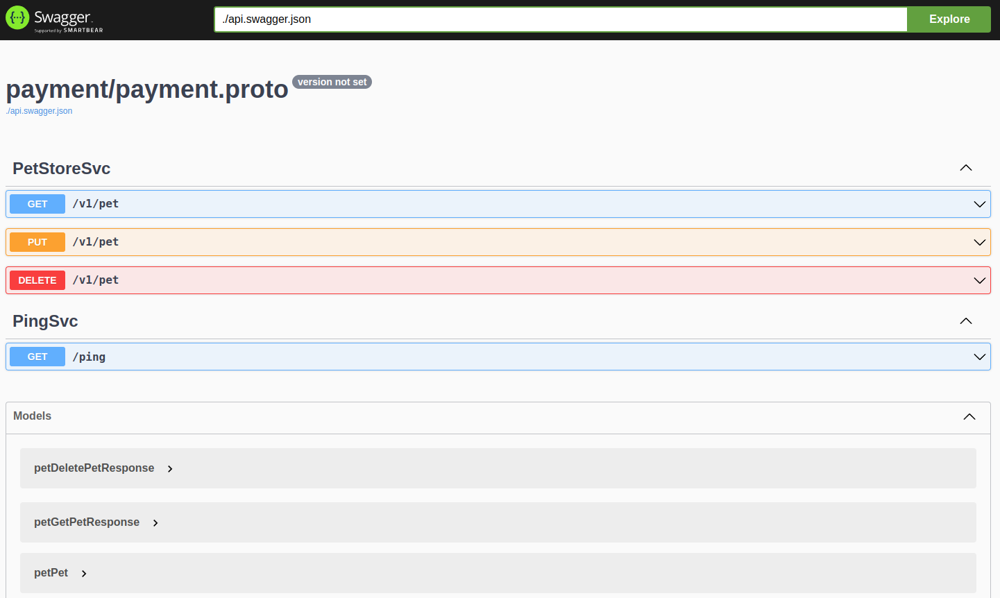
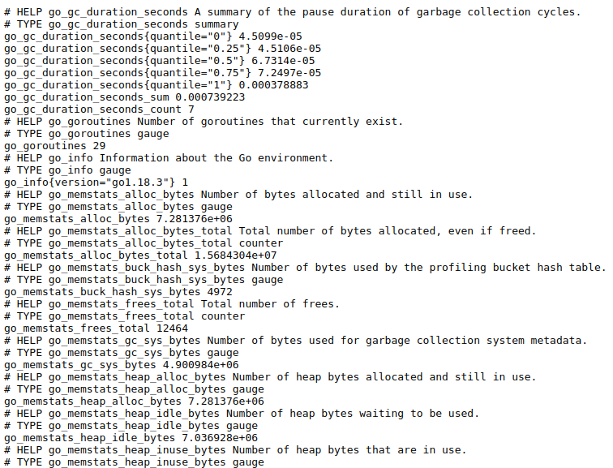

# Easy coding

此项目是一个golang结构的实例项目，旨在解决项目在工程方面不标准的情况

## 项目架构

此项目是根据[Uncle Bob's Clean Architecture](https://blog.cleancoder.com/uncle-bob/2012/08/13/the-clean-architecture.html)来设计的

## 设计原则

[Single source of truth (SSOT)](https://en.wikipedia.org/wiki/Single_source_of_truth)


## 功能

- 所有接口都是由protobuf定义
- 自动生成grpc，grpc-gateway，validate文件
- 每个接口同时提供rest和grpc访问接口
- 自动生成swagger ui文档
- 内置基础的prometheus指标
- 支持将接口导入到postman中进行调试
- 在docker中运行
- 配置管理，配置生成
- 数据库表结构的升级降级
- mock数据库进行单元测试
- golang，protobuf等文件的静态检测与自动修复
- error的分类与管理
- 使用拦截器自动输出日志
- 单元测试和测试覆盖率
- 优雅停止
- 支持启动后台进程
- 健康检查

## 运行前的依赖

- [protoc](https://github.com/protocolbuffers/protobuf#protocol-compiler-installation)

- protoc plugins, go, grpc, grpc-gateway, openapi, validate

``` bash
go install \
    github.com/grpc-ecosystem/grpc-gateway/v2/protoc-gen-grpc-gateway@latest \
    github.com/grpc-ecosystem/grpc-gateway/v2/protoc-gen-openapiv2@latest \
    google.golang.org/protobuf/cmd/protoc-gen-go@latest \
    google.golang.org/grpc/cmd/protoc-gen-go-grpc@latest \
    github.com/envoyproxy/protoc-gen-validate@latest
```

- golang 1.18+

- [protobuf management](https://docs.buf.build/installation)

- [go swagger cli](https://github.com/go-swagger/go-swagger/releases)

- docker and docker compose

- (可选择不安装) pre-commit

``` bash
pip3 install pre-commit
pre-commit install
```

- (可选择不安装) golang lint

``` bash
go install github.com/golangci/golangci-lint/cmd/golangci-lint@latest
```

## 运行程序

**如果下载go的依赖包过慢，更新dockerfile中的`GOPROXY`**

``` bash
make deps
make run
```

**注意: 第一次运行需要手动创建 `test` 数据库，否则会出现以下错误**

``` text
failed to initialize database, got error [driver: bad connection]
```

``` bash
docker exec -it easycoding-mysql-1 bash
mysql -u root -p123456
create database test;
```

执行后会生成以下文件

- api/{module_name}/{module_name}.pb.go
- api/{module_name}/{module_name}.pb.validate.go
- api/{module_name}/{module_name}.pb.swagger.json
- api/{module_name}/rpc_grpc.pb.go
- api/{module_name}/rpc.pb.go
- api/{module_name}/rpc.pb.gw.go
- api/{module_name}/rpc.pb.validate.go
- api/{module_name}/rpc.swagger.json

服务监听了三个端口

- 10000: rest api server
- 10001: grpc api server
- 10002: swagger api and prometheus server

检查rest接口

``` bash
curl http://localhost:10000/ping
```

检查grpc接口

``` bash
go run cmd/client/main.go
```

使用浏览器打开以下链接

- http://localhost:10002/swagger/
- http://localhost:10002/metrics




### 专题1 接口管理

#### 动机

接口是一个抽象的概念，**与语言无关**，是用来描述两个服务沟通的方式，在真实世界中，有很多文件来描述同一个接口

- golang、java中的struct或class
- typescript、javascript中的class
- swagger、openapi文档
- word文档

这么多地方都在描述同一个接口会出现以下场景

1. 同一个概念例如【订单】，在前端需要描述一遍，在后端又需要描述一遍，前后端同学可能没有感觉，但是实际上工作量增加了
2. 产品迭代很快，有可能沟通不及时，导致产品经理提了需求，跟后端的同学提了，但是没和前端提，结果后端改了接口，导致前端同学忽然接口就不能使用了，难免会怀疑自己写的哪里出错了，让前后端同学在写代码的时候没有什么是可以**相信**的，这就会让debug的周期加长，如果能够让每个模块自己闭环的完成任务，一定是迭代最快的方式
3. 产品迭代很快，经常前后端需要通过文档来沟通接口，很多时候文档是不及时的，甚至是错误百出的，这也会让读文档的人陷入难题，看着文档做，如果出错了，那是我哪里做错了，还是文档写错了？如果都有可能，那就还要先诊断是谁的问题
4. 文档本身经常使用word来承载，也不会放在代码仓库中，经常文档没有版本管理，如果checkout到一个分支，很难找到对应的文档

这些情况违背了[`Single source of
truth`](https://en.wikipedia.org/wiki/Single_source_of_truth)原则，所以接口必须要在一个地方描述，语言相关的接口文件和任何格式的文档都应该由描述生成出来。

#### 开始

在这个专题，我们会增加一个打招呼的接口

api/greet_apis/greet/greet.proto

``` protobuf
syntax = "proto3";

package greet;

option go_package = 'easycoding/api/greet';

message HelloRequest {
    string req = 1;
}

message HelloResponse {
    string res = 1;
}
```

api/greet_apis/greet/greet.proto

``` protobuf
syntax = "proto3";

package greet;

option go_package = 'easycoding/api/greet';

import "google/api/annotations.proto";
import "greet/greet.proto";

// The greet service definition.
service GreetSvc {
    rpc Hello(HelloRequest) returns (HelloResponse) {
        option (google.api.http) = {
            get: "/hello",
        };
    }
}
```

api/greet_apis/buf.yaml

``` yaml
version: v1
breaking:
  use:
    - FILE
lint:
  use:
    - DEFAULT
```

api/buf.work.yaml

``` yaml
   - payment_apis
   - pet_apis
   - ping_apis
   # add new line
   - greet_apis
```

在项目根目录运行`make gen-api`，会生成以下文件

``` text
api/greet/greet.pb.go
api/greet/greet.pb.validate.go
api/greet/greet.swagger.json
api/greet/rpc_grpc.pb.go
api/greet/rpc.pb.go
api/greet/rpc.pb.gw.go
api/greet/rpc.pb.validate.go
api/greet/rpc.swagger.json
api/api.swagger.json
```

实现打招呼接口

internal/service/greet/service.go

``` golang
package greet

import (
	"context"
	greet_pb "easycoding/api/greet"

	"github.com/sirupsen/logrus"
)

type service struct{}

var _ greet_pb.GreetSvcServer = (*service)(nil)

func New(logger *logrus.Logger) *service {
	return &service{}
}

func (s *service) Hello(
	ctx context.Context,
	req *greet_pb.HelloRequest,
) (*greet_pb.HelloResponse, error) {
	return &greet_pb.HelloResponse{Res: req.Req}, nil
}
```

更新internal/service/register.go

``` golang
var endpointFuns = []RegisterHandlerFromEndpoint{
	ping_pb.RegisterPingSvcHandlerFromEndpoint,
	pet_pb.RegisterPetStoreSvcHandlerFromEndpoint,
    // add new line
	greet_pb.RegisterGreetSvcHandlerFromEndpoint,
}

func RegisterServers(grpcServer *grpc.Server, logger *logrus.Logger, db *gorm.DB) {
	ping_pb.RegisterPingSvcServer(grpcServer, ping_svc.New(logger))
	pet_pb.RegisterPetStoreSvcServer(grpcServer, pet_svc.New(logger, db))
    // add new line
	greet_pb.RegisterGreetSvcServer(grpcServer, greet_svc.New())
}

```

启动服务

``` bash
make run
```

查看rest服务

``` bash
curl localhost:10000/hello?req=hi
```

最新的文档会生成在`http://localhost:10002/swagger/`, 如果你想自定义文档输出的内容，可以看
[protoc-gen-openapi](https://grpc-ecosystem.github.io/grpc-gateway/docs/mapping/customizing_openapi_output/)

``` proto
message MyMessage {
  // This comment will end up direcly in your Open API definition
  string uuid = 1 [(grpc.gateway.protoc_gen_openapiv2.options.openapiv2_field) = {description: "The UUID field."}];
}
```

最新的指标数据放在`http://localhost:10002/metrics`, 可以使用`prometheus-client`来自定义指标，可以看
[go-grpc-prometheus](https://github.com/grpc-ecosystem/go-grpc-prometheus/blob/master/examples/grpc-server-with-prometheus/server/server.go#L39)中的例子

``` golang
customizedCounterMetric = prometheus.NewCounterVec(prometheus.CounterOpts{
    Name: "demo_server_say_hello_method_handle_count",
    Help: "Total number of RPCs handled on the server.",
}, []string{"name"})
```

可以给接口增加一些检查器

``` protobuf
syntax = "proto3";

package greet;

option go_package = 'easycoding/api/greet';

// add new line
import "validate/validate.proto";

message HelloRequest {
    // add validate
    string req = 1[(validate.rules).string = {min_len: 0, max_len: 10}];
}

message HelloResponse {
    string res = 1;
}
```

停止服务，并且重新跑`make gen-api` 和 `make run`

发送以下请求会收到一个错误，如果想要更多的检查器可以查看
[protoc-gen-validate](https://github.com/envoyproxy/protoc-gen-validate).

``` bash
curl localhost:10000/hello?req=hiiiiiiiiii
```

检查器是在grpc的拦截器中被检查触发的，如果检查失败会直接返回，更多在拦截器可以查看
[grpc-middleware](https://github.com/grpc-ecosystem/go-grpc-middleware),
也可以很容易的定义自己的检查器.

### 专题2 数据库升级与降级

#### 动机

在真实世界中，可能会出现以下场景

1. 写代码的人每次给出一个当前版本全量的sql文件，部署的人不知道当前版本和上个版本的变化，不能确认执行哪些sql
2. 写代码的人每次升级都会给出需要执行的sql文件，但是部署的人可能忘记执行或者多执行了一些sql语句，无法知道每次升级到底执行了哪些语句，没有执行哪些语句
3. 升级可能连续升级多个版本，降级多个版本，如果sql文件没有从程序化的当时和版本对应上，升级降级都要人工操作就会比较慢，还容易出错
4. 数据库的权限控制的不好，有可能有其他人因为一些原因，到数据库中执行了一些sql脚本，但是没有告诉其他人，其他人在升级过程中出错，没有办法判断是谁的错
5. 因为某些原因使得生产环境版本回滚，数据库也应该回滚，很多写代码的人只会写升级sql文件，不会写降级的sql文件，使得没有办法干净的回滚

在代码中写sql来对数据库进行操作是很难维护的，通常是使用ORM作为中间层来进行交互，本项目使用[Gorm](https://github.com/go-gorm/gorm)，另一个问题是随着业务的迭代，我们经常会更新数据库结构，这是必然的，但是在很多公司，写代码和部署代码不是同一个人，部署代码的人只能僵硬的去执行写代码的人给的sql升级文件，如果一旦出现错误，无法判断如何解决，而且经常业务会有升级和回滚，一方面代码本身要使用【双写】等等的机制来保证数据表的向前兼容，但是表结构本身也要支持版本管理，那就必然需要回滚。另一方面，我们如果有了升级的文件就可以比较容易的结合CI、CD流程集成测试，自动升级。最后一个问题是我们手动的写升级和降级的sql文件是非常困难的，也比较难以维护，所以尽量可以做到自动生成。

#### 开始

现在 `test` 数据库完全是空的，使用以下命令来创建数据库初始化sql文件

``` bash
make migrate-create
```

执行成功后会生成以下文件, 如果想了解为什么会是这种结构，可以查看[migrate](https://github.com/golang-migrate/migrate)

``` text
migrations/pet/{timestamp}_pet.up.sql
migrations/pet/{timestamp}_pet.down.sql
```

通常在云原生的场景下，升级数据库结构，通常是要启动一个[kubernetes job](https://kubernetes.io/docs/concepts/workloads/controllers/job/)，所以这个命令没有和makefile结合

``` bash
go run cmd/migrate/main.go step --latest
```

``` text
INFO[0000] Start buffering 20220723144816/u pet         
INFO[0000] Read and execute 20220723144816/u pet        
INFO[0000] Finished 20220723144816/u pet (read 5.465976ms, ran 57.983119ms)
```

升级成功，使用 `describe pet` 查看表结构

``` text
+------------+----------+------+-----+-------------------+-------------------+
| Field      | Type     | Null | Key | Default           | Extra             |
+------------+----------+------+-----+-------------------+-------------------+
| id         | int      | YES  |     | NULL              |                   |
| name       | text     | YES  |     | NULL              |                   |
| type       | int      | YES  |     | NULL              |                   |
| created_at | datetime | YES  |     | CURRENT_TIMESTAMP | DEFAULT_GENERATED |
+------------+----------+------+-----+-------------------+-------------------+
4 rows in set (0.01 sec)
```

更新 pkg/orm/pet.go

``` text
--- a/pkg/orm/pet.go
+++ b/pkg/orm/pet.go
@@ -12,6 +12,7 @@ type Pet struct {
        Name string
        // TODO(qujiabao): replace int32 to pet_pb.PetType, because of `sqlize`
        Type      int32
+       Age       int32
        CreatedAt time.Time `gorm:"default:now()"`
 }
```

再次生成数据库升级和降级文件，又有两个文件生成了，这时候 migrations/pet下面会有四个文件

``` bash
make migrate-create
```

升级

``` bash
go run cmd/migrate/main.go step --latest
```

查看数据库的版本

``` bash
go run cmd/migrate/main.go version
```

``` text
Version: 20220723150428, Dirty: false
```

``` text
+------------+----------+------+-----+-------------------+-------------------+
| Field      | Type     | Null | Key | Default           | Extra             |
+------------+----------+------+-----+-------------------+-------------------+
| id         | int      | YES  |     | NULL              |                   |
| name       | text     | YES  |     | NULL              |                   |
| type       | int      | YES  |     | NULL              |                   |
| age        | int      | YES  |     | NULL              |                   |
| created_at | datetime | YES  |     | CURRENT_TIMESTAMP | DEFAULT_GENERATED |
+------------+----------+------+-----+-------------------+-------------------+
5 rows in set (0.00 sec)
```

数据库降级

``` bash
go run cmd/migrate/main.go step 1 --reverse
```

``` text
Version: 20220723144816, Dirty: false

+------------+----------+------+-----+-------------------+-------------------+
| Field      | Type     | Null | Key | Default           | Extra             |
+------------+----------+------+-----+-------------------+-------------------+
| id         | int      | YES  |     | NULL              |                   |
| name       | text     | YES  |     | NULL              |                   |
| type       | int      | YES  |     | NULL              |                   |
| created_at | datetime | YES  |     | CURRENT_TIMESTAMP | DEFAULT_GENERATED |
+------------+----------+------+-----+-------------------+-------------------+
4 rows in set (0.00 sec)
```

### Topic3 静态检测

### Topic4 错误处理

### Topic5 配置管理

### Topic6 单元测试和覆盖率

### Topic7 交付和部署

### Topic8 监控，日志和链路跟踪

## TODO

- Use reflect in configration
- Benchmark
- Fix linting
- Intergration test
- Auth
- More options in configuration
- Property based test
- GraphQL server

## 灵感

- https://github.com/OFFLINE-GmbH/go-webapp-example
- https://github.com/golang-standards/project-layout